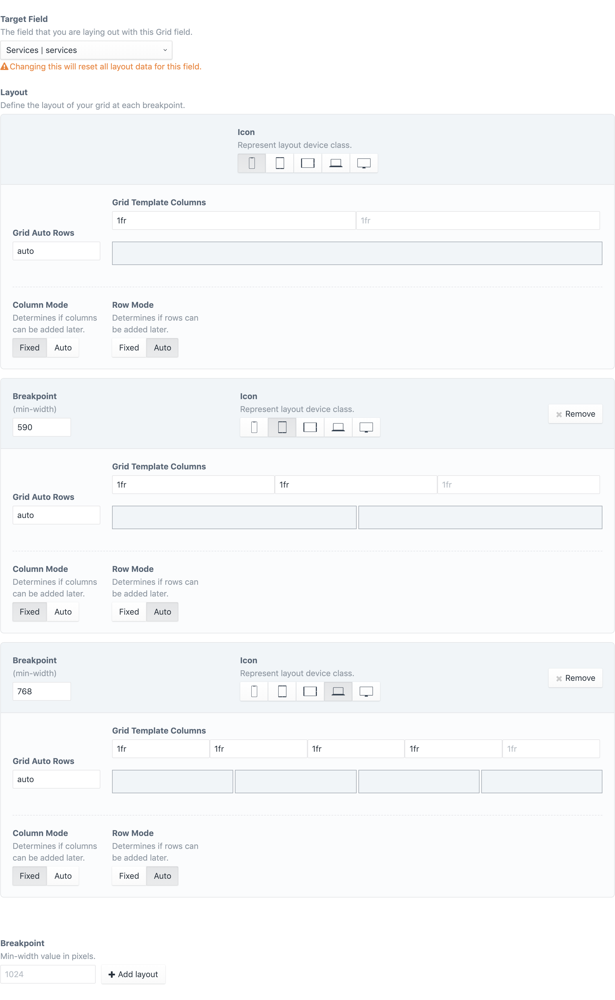
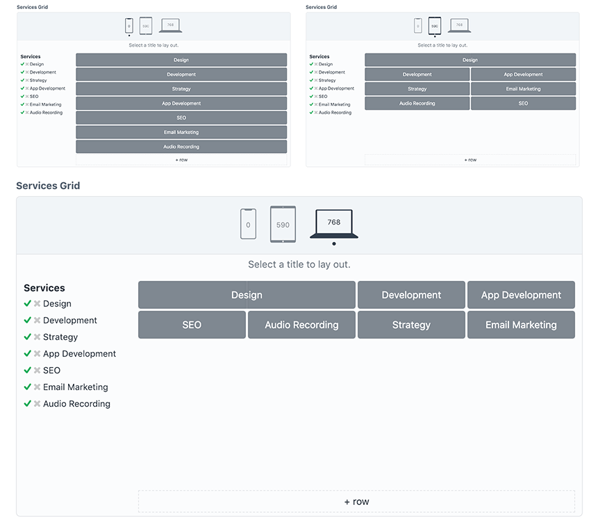
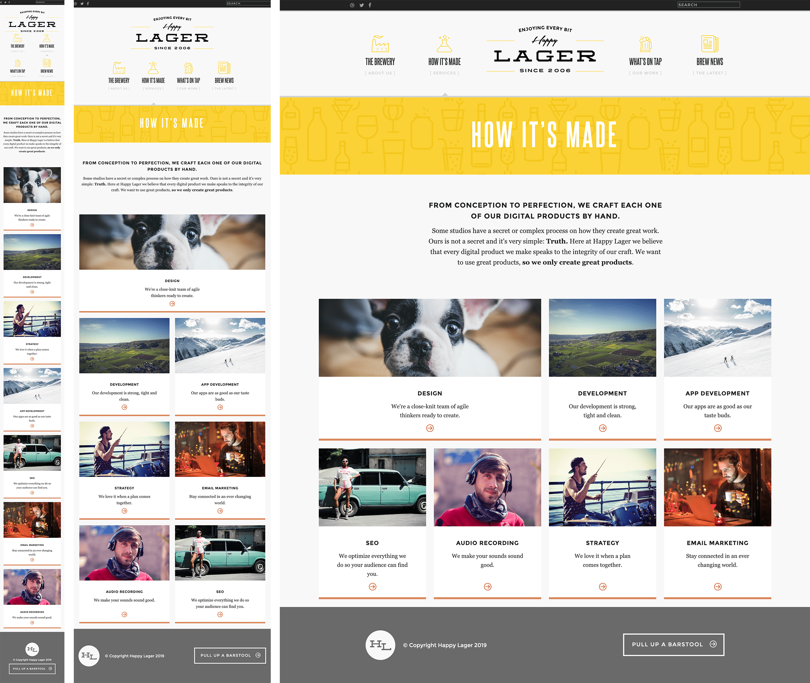
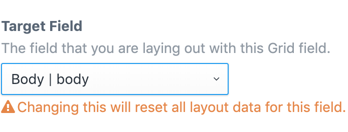
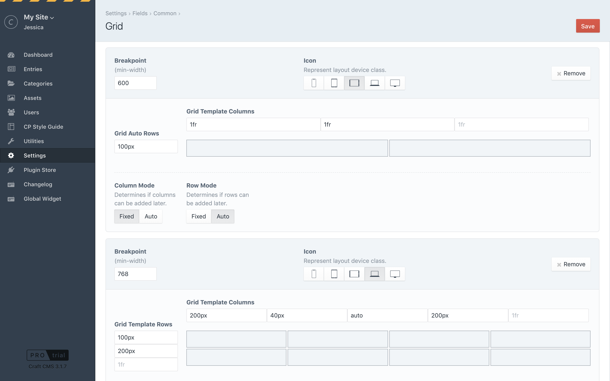
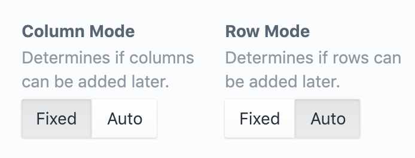
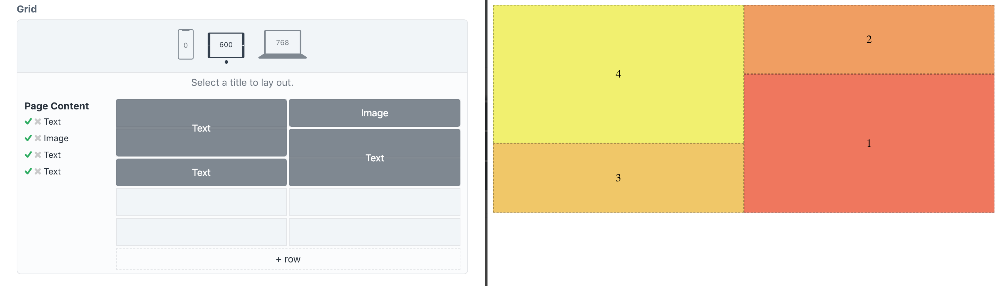

# Grid for Craft CMS 3.1+

A field that lets you content manage CSS Grid in Craft CMS.

## Requirements

This plugin requires Craft CMS 3.1.7 or later.
A browser that support CSS Grid Layout and CSS Custom Properties. For more information on browser support, see [Browser Support](https://github.com/wbrowar/craft-grid#browser-support), below.

## Installation

To install the plugin, you can find it in the [Craft Plugin Store](https://plugins.craftcms.com/grid), or follow these instructions.

1. Open your terminal and go to your Craft project:

        cd /path/to/project

2. Then tell Composer to load the plugin:

        composer require wbrowar/craft-grid

3. In the Control Panel, go to Settings → Plugins and click the “Install” button for Grid.

## Grid Overview

Grid is a field that lets content editors lay out content connected through matrix and other relation fields (entries, assets, etc...).

Grid‘s settings let you define CSS grid rules for different layout breakpoints.



Content editors can optimize content layout for different screen sizes.



[Flexible Twig tags](https://github.com/wbrowar/craft-grid#adding-grid-to-a-twig-template) create the grid container and wraps all of the grid items while generating the CSS for each layout.



## Configuring Grid

### Target Field

Grid fields can be paired up with an element-based field. In Grid, this is called the "target field".

When setting up a Grid field a drop down field selects the target field from a list of supported field types, so it is best to create the target field before creating a Grid field.



*Once a Grid field is used and there is data stored in the CMS, it‘s important that the target field is not changed. Changing the target field will result in lost or corrupt Grid data.*

### Supported Field Types

#### Core
- Assets
- Categories
- Entries
- Matrix
- Users

#### Craft Commerce
- Products
- Variants

### Using Grid Without a Target Field

Grid can also be used as a general layout field when the content you want to lay out is not managed through the CMS. For example, this could be used for content collected by an element query, items in a table field, and data pulled from a decoded JSON string.

To use a grid field without a target field, leave the `Target Field` option set to `None` on the field setting page.

When rendering a grid field that doesn‘t have a target field, the data must be in the form of an array and it must be passed into the `` block, as detailed in [Advanced Twig Options](https://github.com/wbrowar/craft-grid/blob/master/README.md#advanced-twig-options).

### Field Settings

#### Layouts

Grid‘s CSS code is generated mobile first, so the first grid layout is meant for mobile devices or it can used without any other breakpoints. To create additional grid layouts, create a breakpoint at the bottom of the page.

When adding a layout, the breakpoint‘s `min-width` value is required. This is set as a number in pixel units. Grid layouts are sorted from smallest to largest breakpoint `min-width` value.



---

#### Columns and Rows

Columns and rows can be configured to a fixed layout or they can give editors the ability to add or remove columns and rows as needed. When you change the mode of a column or row, you‘ll see the fields that define the grid will change.



##### Auto Mode

Setting a Row Mode to `auto` is like defining a CSS [`grid-auto-rows`](https://developer.mozilla.org/en-US/docs/Web/CSS/grid-auto-rows) property. Content editors will be able to create as many rows as needed and the layout will follow the value you place in the Grid Auto Rows field.

Any valid `grid-auto-rows` value can be used in the Grid Auto Rows field. Mozilla offers some great examples on their web docs page: [MDN grid-auto-rows](https://developer.mozilla.org/en-US/docs/Web/CSS/grid-auto-rows#Syntax)

*NOTE: Column Mode works the same way, and example values can be found here: [MDN grid-auto-columns](https://developer.mozilla.org/en-US/docs/Web/CSS/grid-auto-columns#Syntax)*

##### Fixed Mode

When you want to define the exact column layout, setting Column Mode to `fixed` will let you define each column, just like [`grid-template-columns`](https://developer.mozilla.org/en-US/docs/Web/CSS/grid-template-columns) would. For each column, enter in a valid size and you will see the grid preview reflect the amount of columns you have defined.

You can use valid sizing units—such as `fr`, `px`, `%`, `em`, or `rem`—and you can even use functions—like `minmax()`—or keyword value—like `max-content`. However, **values that create multiple columns—like the `repeat()` function—should not be used in `fixed` mode** because they will not be interpreted by the Grid field.

*Row Mode works the same way for fixed row layouts.*

##### Item Visibility

By default, items that are not laid out onto a grid field layout will be hidden using CSS (`display: none`, `visibility: hidden`, `opacity: 0`, etc ...). Using the `Item Visibility` option, you may allow all items be visible and they will be added to your grid based on your grid‘s CSS.

This could be useful on single-column layouts where you want to display all grid items in order, without taking the time to add each item to the layout.

*NOTE: When there is no room left on a grid layout items can sometimes appear outside of the grid.*

---

## Using the Grid Field



When a Grid field is added to an element—such as an entry—it will look for its target field and display all of the items that populate the target field. At first, the field shows information for the smallest layout and at the top of the field you will see an icon that lets you select other layouts.

To lay out a piece of content onto the grid, click on the title of the content to begin. Click on a cell in the grid to set the starting point in that cell, then click on the same cell or on another cell to set the ending point.

When a piece of content has been laid onto the grid, a check mark will appear next to the title.

*TIP: Because CSS Grid allows it, you can overlap items in your layout. The order of the items in the target field determines which items are in the front and which are in the back.*

---

### Adding Grid to a Twig Template

To render a grid field, drop this into your Twig template.

```twig

    
        
            {# use item.content.fieldHandle to render grid item content #}
        
    

```

- The `grid` block requires that you pass in your grid field (`entry.gridHandle`). Grid will determine the element and target field associated with the Grid field, however this can also be set (see [Advanced Twig Options](https://github.com/wbrowar/craft-grid#advanced-twig-options)). The `grid` block creates an HTML element along with the appropriate classes.
- On the `grid` block, `gridItems` is a variable that‘s name can be set to anything you‘d like.
- `gridItems` represents all of the content in the target field—along with data from the `grid` block. A `for` loop is used to access each grid item.
- The `griditem` block creates an HTML element with the right classes to make your layout work.
- The content for each `item` can be accessed through `{{ item.content.fieldHandle }}`. For example, if each `item.content` was an entry, `{{ item.content.title }}` would display the title field.
- Here's an example of a matrix field that is processed inside of the `griditem` block:

```twig

    
        
            
                
                    <p>{{ item.content.myText }}</p>
                
                    
            
        
    

```

---

#### Advanced Twig Options
The `grid` block and `griditem` block accept more arguments and configuration when needed.

##### Target Array

To specify your target field or to use eager loading for your target field, add your target field and the keyword `using` before your Grid field on the `grid` block:

```twig

    {# ... #}

```

In this example, `entry.relatedEntries` is specified and eager loading is used to get a `featuredImage` asset.

*NOTE: This must be in the form of an array, so it‘s important that you use `.all()` when passing in element criteria.*

---

##### Modify the Grid Container

By default, the `grid` block is turned into a `<div>` tag with predefined classes on it. A configuration object can be passed in to modify the tag, add classes, and set custom attributes.

```twig

    {# ... #}

```

| Argument | Default | Description |
| --- | --- | --- |
| `attributes` | `''` | Add in any valid HTML attribute, `data-` attributes, Vue directives, etc... |
| `classes` | `''` | Adds classes into the element‘s `class` attribute. This can by helpful for styling the grid container and its child items. |
| `element` | `'div'` | Change the element for more semantic HTML or for better accessibility. |
| `preview` | `false` | Setting this to `true` adds simple styling to let you preview your content in your grid layout. This is meant to be used for early development and may not work with content that is already styled. |
| `unit` | `px` | Converts media queries generated by the `grid` block to `em` or `rem` units (based on a 16px default font size). Accepts `em`, `rem`, or `px`. |

---

##### Modify Grid Items

The `griditem` block creates a `<div>` tag for each grid item. A configuration object can be passed in to modify the tag, add classes, and set custom attributes.

```twig

    
        
            {# ... #}
        
    

```

| Argument | Default | Description |
| --- | --- | --- |
| `attributes` | `''` | Add in any valid HTML attribute, `data-` attributes, Vue directives, etc... |
| `classes` | `''` | Adds classes into the element‘s `class` attribute. |
| `element` | `'div'` | Change the element for more semantic HTML or for better accessibility. |

---

### Getting a Grid Value

Accessing a grid field value using `$element->gridHandle` (in PHP) or `{{ element.gridHandle }}` (in Twig) will give you data as it is stored into Craft, but this is condensed and not meant for output.

If you would like access to the value of a grid/target pair, a PHP function and Twig variable are available. Both return the same array of information and they both require that you pass in the target value and the grid value.

The output will include:

| Value | Description |
| --- | --- |
| `css` | The CSS that is generated for the grid/target pair. |
| `grid` | Information on the grid, such as the selector used when generating the Grid CSS. |
| `items` | An array of information for each grid item, such as the selector and which layouts have been set for each item. |

*NOTE: Both the PHP method and twig variable require that you pass in the target as an array, so use `.all()` or eager loading before passing it in.*

#### Getting a Grid Value from a Module or Plugin

```php
$entry = Entry::find()
    ->with(['pageContent'])
    ->one();

$gridValue = Grid::$plugin->grid->getGridValue($entry->pageContent, $entry->grid);
```

#### Getting a Grid Value from Twig

```twig

```

### New to CSS Grid Layout?

If you haven't used CSS Grid Layout in your projects before, here are a few resources that can help you understand its concepts:

- [The Experimental Layout LAB of Jen Simmons](https://labs.jensimmons.com)
- [Grid by Example](https://gridbyexample.com)
- [CSS Grid (course by Wes Bos)](https://cssgrid.io)

### Browser Support

CSS Grid actually started out as a [feature in Internet Explorer 10](https://caniuse.com/#feat=css-grid), however, since then an updated spec has emerged and gained support in modern browsers. While it is possible—and often easy—to support the IE spec, Grid only supports the modern, non-prefixed spec.

To ensure that the right CSS spec is available, all of the CSS generated by Grid is wrapped in an `@supports` query. CSS Feature Queries and CSS Custom Properties—which is what the query is validating—are not available on any version of IE.

---

Brought to you by [Will Browar](http://wbrowar.com).

Thank you to [Marc Hartwig](https://github.com/MarcHartwig13) and [Andrew Welch](https://github.com/nystudio107) for your advice and suggestions.
